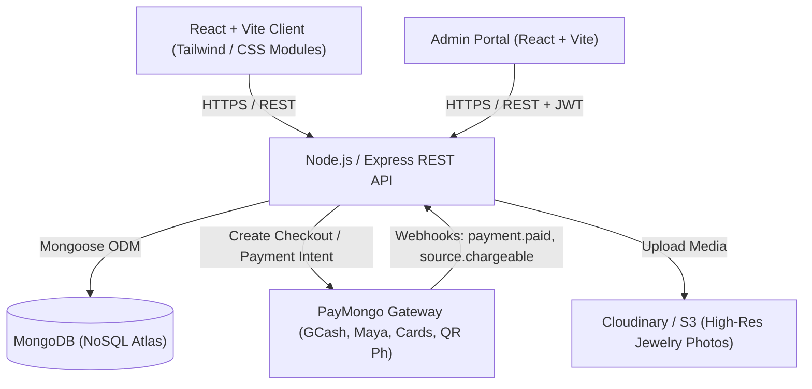
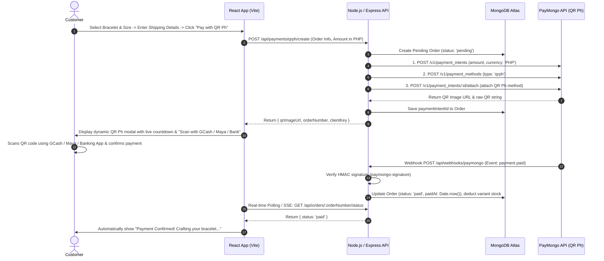

# Bracelet E-Commerce Platform — Comprehensive Architecture & Framework

A full-stack e-commerce framework tailored for a specialized jewelry and bracelet brand, powered by **React (Vite)**, **Node.js/Express**, **MongoDB (NoSQL)**, and **PayMongo**.

---

## 1. System Architecture Overview



---

## 2. Tech Stack Specification

| Layer | Technology | Rationale |
|---|---|---|
| **Frontend** | React 18/19 + Vite + TypeScript / JavaScript | Lightning-fast HMR, sub-second builds, modular component architecture. |
| **State Management** | Zustand + TanStack Query (React Query) | Zustand for client state (Cart, Customizer), TanStack Query for server caching & optimistic UI. |
| **Styling & UI** | Tailwind CSS + Lucide Icons + Framer Motion | Smooth luxury micro-interactions, responsive wrist-size selectors, dynamic charm customizer. |
| **Backend** | Node.js + Express (ES Modules / TypeScript) | Scalable, non-blocking I/O with rich middleware ecosystem. |
| **Database** | MongoDB + Mongoose ODM | Flexible schema for jewelry variants (bead sizes, wrist sizes, custom charms, gemstones, materials). |
| **Payment Gateway** | PayMongo API (v1) | Full support for Philippine and international payments: **GCash, Maya, Credit/Debit Cards, QR Ph, GrabPay, Billease**. |
| **Media / CDN** | Cloudinary / AWS S3 | Automatic image optimization, WebP delivery, multi-angle zoom for fine jewelry textures. |
| **Auth & Security** | JWT (HttpOnly cookies) + bcrypt + Helmet + Express-Rate-Limit | Secure session handling with guest checkout capability. |

---

## 3. Bracelet-Specific Domain Models (NoSQL / MongoDB)

Jewelry e-commerce requires specialized schemas to handle **wrist sizing, bead/metal variants, custom engravings, and modular charm builders**.

### A. Product Schema (`models/Product.js`)
```javascript
import mongoose from 'mongoose';

const VariantSchema = new mongoose.Schema({
  sku: { type: String, required: true, unique: true },
  wristSizeCm: { type: Number, required: true }, // e.g., 14, 16, 18, 20
  beadSizeMm: { type: Number, default: 8 },      // e.g., 6mm, 8mm, 10mm
  material: { type: String, required: true },    // '14K Gold', '925 Sterling Silver', 'Obsidian', 'Rose Quartz'
  price: { type: Number, required: true },       // in Centavos or PHP (e.g., 1500.00)
  stock: { type: Number, required: true, default: 0 },
  images: [{ type: String }]
});

const ProductSchema = new mongoose.Schema({
  name: { type: String, required: true, trim: true },
  slug: { type: String, required: true, unique: true, lowercase: true },
  description: { type: String, required: true },
  collectionType: { 
    type: String, 
    enum: ['Beaded', 'Cuff', 'Chain', 'Charm', 'Custom', 'Couple'], 
    required: true 
  },
  basePrice: { type: Number, required: true },
  variants: [VariantSchema],
  customizable: {
    allowEngraving: { type: Boolean, default: false },
    maxEngravingChars: { type: Number, default: 12 },
    engravingCost: { type: Number, default: 0 },
    allowCharmSelection: { type: Boolean, default: false },
    maxCharms: { type: Number, default: 5 }
  },
  tags: [String],
  isFeatured: { type: Boolean, default: false },
  isActive: { type: Boolean, default: true }
}, { timestamps: true });

export default mongoose.model('Product', ProductSchema);
```

### B. Order & Payment Schema (`models/Order.js`)
```javascript
import mongoose from 'mongoose';

const OrderItemSchema = new mongoose.Schema({
  product: { type: mongoose.Schema.Types.ObjectId, ref: 'Product', required: true },
  variantSku: { type: String, required: true },
  name: { type: String, required: true },
  price: { type: Number, required: true },
  quantity: { type: Number, required: true, min: 1 },
  selectedWristSize: { type: String },
  customEngravingText: { type: String, default: null },
  selectedCharms: [{ type: String }],
  itemTotal: { type: Number, required: true }
});

const OrderSchema = new mongoose.Schema({
  orderNumber: { type: String, required: true, unique: true },
  user: { type: mongoose.Schema.Types.ObjectId, ref: 'User', default: null }, // Nullable for Guest Checkout
  customer: {
    fullName: { type: String, required: true },
    email: { type: String, required: true },
    phone: { type: String, required: true },
    shippingAddress: {
      street: { type: String, required: true },
      barangay: { type: String, required: true },
      city: { type: String, required: true },
      province: { type: String, required: true },
      postalCode: { type: String, required: true },
      country: { type: String, default: 'Philippines' }
    }
  },
  items: [OrderItemSchema],
  subtotal: { type: Number, required: true },
  shippingFee: { type: Number, default: 0 },
  discountTotal: { type: Number, default: 0 },
  grandTotal: { type: Number, required: true },
  payment: {
    gateway: { type: String, default: 'PayMongo' },
    paymongoCheckoutSessionId: { type: String },
    paymongoPaymentIntentId: { type: String },
    paymentMethod: { type: String }, // 'gcash', 'paymaya', 'card', 'qrph', 'dob'
    paymentStatus: { 
      type: String, 
      enum: ['pending', 'paid', 'failed', 'refunded', 'expired'], 
      default: 'pending' 
    },
    paidAt: { type: Date }
  },
  fulfillmentStatus: {
    type: String,
    enum: ['unfulfilled', 'crafting', 'packed', 'shipped', 'delivered', 'cancelled'],
    default: 'unfulfilled'
  },
  trackingNumber: { type: String, default: null }
}, { timestamps: true });

export default mongoose.model('Order', OrderSchema);
```

---

## 4. PayMongo QR Ph Payment Architecture

Because **QR Ph** is the Philippine National QR standard, your customers can scan and pay using **any banking or e-wallet app** (GCash, Maya, BDO, BPI, UnionBank, SeaBank, GoTyme, GrabPay, RCBC, etc.).

There are two ways to implement QR Ph with PayMongo:
1. **Hosted PayMongo Checkout Session (Simplest)**: PayMongo presents the dynamic QR Ph screen and handles redirection.
2. **Direct In-App QR Ph (Seamless / Best User Experience)**: The QR Ph code is generated via Payment Intents and displayed directly inside your React modal/screen with real-time payment detection.

### A. Seamless QR Ph Payment Sequence



### B. PayMongo QR Ph Controller (`server/controllers/paymentController.js`)

```javascript
import axios from 'axios';
import Order from '../models/Order.js';

const PAYMONGO_SECRET = process.env.PAYMONGO_SECRET_KEY;
const authHeader = `Basic ${Buffer.from(`${PAYMONGO_SECRET}:`).toString('base64')}`;

// Approach 1: In-App Direct QR Ph Generation (Recommended)
export const generateInAppQRPh = async (req, res) => {
  try {
    const { orderId } = req.body;
    const order = await Order.findById(orderId);
    if (!order) return res.status(404).json({ message: 'Order not found' });

    const amountInCentavos = Math.round(order.grandTotal * 100);

    // 1. Create Payment Intent
    const intentRes = await axios.post(
      'https://api.paymongo.com/v1/payment_intents',
      {
        data: {
          attributes: {
            amount: amountInCentavos,
            payment_method_allowed: ['qrph'],
            payment_method_options: {
              card: { request_three_d_secure: 'any' }
            },
            currency: 'PHP',
            description: `Payment for Bracelet Order #${order.orderNumber}`,
            statement_descriptor: 'BRACELET JEWELRY',
            metadata: {
              orderId: order._id.toString(),
              orderNumber: order.orderNumber
            }
          }
        }
      },
      { headers: { Authorization: authHeader, 'Content-Type': 'application/json' } }
    );

    const paymentIntentId = intentRes.data.data.id;
    const clientKey = intentRes.data.data.attributes.client_key;

    // 2. Create QR Ph Payment Method
    const methodRes = await axios.post(
      'https://api.paymongo.com/v1/payment_methods',
      {
        data: {
          attributes: {
            type: 'qrph',
            billing: {
              name: order.customer.fullName,
              email: order.customer.email,
              phone: order.customer.phone
            }
          }
        }
      },
      { headers: { Authorization: authHeader, 'Content-Type': 'application/json' } }
    );

    const paymentMethodId = methodRes.data.data.id;

    // 3. Attach Payment Method to Intent
    const attachRes = await axios.post(
      `https://api.paymongo.com/v1/payment_intents/${paymentIntentId}/attach`,
      {
        data: {
          attributes: {
            payment_method: paymentMethodId,
            client_key: clientKey,
            return_url: `${process.env.CLIENT_URL}/checkout/success?orderNumber=${order.orderNumber}`
          }
        }
      },
      { headers: { Authorization: authHeader, 'Content-Type': 'application/json' } }
    );

    const nextAction = attachRes.data.data.attributes.next_action;
    const qrCodeUrl = nextAction?.code?.image_url;

    // Save Intent ID to Order
    order.payment.paymongoPaymentIntentId = paymentIntentId;
    order.payment.paymentMethod = 'qrph';
    await order.save();

    res.json({
      success: true,
      orderNumber: order.orderNumber,
      paymentIntentId,
      qrCodeUrl, // Image URL of the dynamic QR Ph code
      amount: order.grandTotal,
      expiresAt: nextAction?.code?.expires_at
    });
  } catch (error) {
    console.error('PayMongo QR Ph Error:', error.response?.data || error.message);
    res.status(500).json({ error: 'Failed to generate QR Ph code' });
  }
};

// Approach 2: Hosted PayMongo Checkout Session with QR Ph only
export const createHostedQRPhSession = async (req, res) => {
  try {
    const { orderId } = req.body;
    const order = await Order.findById(orderId);
    if (!order) return res.status(404).json({ message: 'Order not found' });

    const lineItems = order.items.map(item => ({
      name: `${item.name} (${item.selectedWristSize || 'Standard'})`,
      amount: Math.round(item.price * 100),
      currency: 'PHP',
      quantity: item.quantity,
      description: item.customEngravingText ? `Engraving: "${item.customEngravingText}"` : undefined
    }));

    if (order.shippingFee > 0) {
      lineItems.push({
        name: 'Shipping Fee',
        amount: Math.round(order.shippingFee * 100),
        currency: 'PHP',
        quantity: 1
      });
    }

    const payload = {
      data: {
        attributes: {
          send_email_receipt: true,
          show_description: true,
          show_line_items: true,
          payment_method_types: ['qrph'], // Exclusively QR Ph
          line_items: lineItems,
          success_url: `${process.env.CLIENT_URL}/checkout/success?orderNumber=${order.orderNumber}`,
          cancel_url: `${process.env.CLIENT_URL}/checkout/cancel?orderNumber=${order.orderNumber}`,
          metadata: {
            orderId: order._id.toString(),
            orderNumber: order.orderNumber
          }
        }
      }
    };

    const response = await axios.post('https://api.paymongo.com/v1/checkout_sessions', payload, {
      headers: { Authorization: authHeader, 'Content-Type': 'application/json' }
    });

    const checkoutData = response.data.data;
    order.payment.paymongoCheckoutSessionId = checkoutData.id;
    order.payment.paymentMethod = 'qrph';
    await order.save();

    res.json({
      checkoutUrl: checkoutData.attributes.checkout_url,
      sessionId: checkoutData.id
    });
  } catch (error) {
    console.error('PayMongo Checkout Session Error:', error.response?.data || error.message);
    res.status(500).json({ error: 'Failed to create QR Ph checkout session' });
  }
};
```

### C. Webhook Signature Verification (`server/middleware/paymongoWebhook.js`)
```javascript
import crypto from 'crypto';
import Order from '../models/Order.js';
import Product from '../models/Product.js';

export const handlePaymongoWebhook = async (req, res) => {
  const signatureHeader = req.headers['paymongo-signature'];
  const webhookSecret = process.env.PAYMONGO_WEBHOOK_SECRET;

  if (!signatureHeader || !webhookSecret) {
    return res.status(400).send('Missing webhook signature');
  }

  // Parse signature header: t=timestamp,te=test_sig,li=live_sig
  const parts = Object.fromEntries(signatureHeader.split(',').map(kv => kv.split('=')));
  const timestamp = parts.t;
  const signature = parts.li || parts.te;
  const rawBody = req.rawBody; // Express must capture raw body for webhook route

  const expectedSignature = crypto
    .createHmac('sha256', webhookSecret)
    .update(`${timestamp}.${rawBody}`)
    .digest('hex');

  if (signature !== expectedSignature) {
    return res.status(401).send('Invalid signature');
  }

  const event = req.body.data;
  const eventType = event.attributes.type;

  if (eventType === 'checkout_session.payment.paid') {
    const paymentData = event.attributes.data;
    const orderId = paymentData.attributes.metadata?.orderId;
    
    if (orderId) {
      const order = await Order.findById(orderId);
      if (order && order.payment.paymentStatus !== 'paid') {
        order.payment.paymentStatus = 'paid';
        order.payment.paidAt = new Date();
        order.payment.paymentMethod = paymentData.attributes.payment_method_type || 'paymongo';
        order.fulfillmentStatus = 'crafting';
        await order.save();
        
        // Decrement stock in catalog
        for (const item of order.items) {
          await Product.updateOne(
            { _id: item.product, 'variants.sku': item.variantSku },
            { $inc: { 'variants.$.stock': -item.quantity } }
          );
        }
      }
    }
  }

  res.status(200).json({ received: true });
};
```

---

## 5. Project Directory Structure

```
bracelet-ecommerce/
├── client/                     # Frontend (React + Vite)
│   ├── public/
│   │   ├── images/
│   │   └── favicon.svg
│   ├── src/
│   │   ├── assets/             # Brand SVGs, textures, fonts
│   │   ├── components/
│   │   │   ├── common/         # Button, Modal, Badge, Toast, Loader
│   │   │   ├── layout/         # Navbar, Footer, MobileDrawer, AnnouncementBar
│   │   │   ├── product/        # ProductCard, WristSizeGuide, BeadSelector, EngravingForm
│   │   │   ├── customizer/     # 3D/2D Interactive Bracelet Builder
│   │   │   ├── cart/           # CartDrawer, CartItem, OrderSummary
│   │   │   └── checkout/       # AddressForm, PayMongoTrigger, OrderReview
│   │   ├── context/            # Global UI context
│   │   ├── hooks/              # useCart, useProductFilter, usePayMongo
│   │   ├── pages/              # Home, Shop, ProductDetail, CustomBuilder, Checkout, Success, OrderTracking
│   │   ├── services/           # api.js, productService.js, orderService.js
│   │   ├── store/              # zustand: useCartStore, useCustomizerStore, useAuthStore
│   │   ├── styles/             # index.css (design system variables, luxury tokens)
│   │   ├── utils/              # formatCurrency.js (PHP ₱), wristCalculators.js
│   │   ├── App.jsx
│   │   └── main.jsx
│   ├── package.json
│   └── vite.config.js
│
├── server/                     # Backend (Node.js + Express)
│   ├── src/
│   │   ├── config/             # db.js (Mongoose connection), paymongo.js, cloudinary.js
│   │   ├── controllers/        # authController, productController, orderController, paymentController
│   │   ├── middleware/         # authMiddleware, errorHandler, validateBody, rawBodyCapture
│   │   ├── models/             # User.js, Product.js, Order.js, Review.js, Coupon.js
│   │   ├── routes/             # authRoutes.js, productRoutes.js, orderRoutes.js, webhookRoutes.js
│   │   ├── services/           # paymongoService.js, emailService.js (Receipts & shipping updates)
│   │   ├── utils/              # generateOrderNumber.js, tokenUtils.js
│   │   └── app.js              # Express app setup & middleware
│   ├── .env.example
│   ├── package.json
│   └── server.js               # HTTP server entrypoint
│
├── .gitignore
└── README.md
```

---

## 6. REST API Endpoints Specification

### Products & Customizer
- `GET /api/products` — Filter by collection, gemstone, bead size, wrist size, price range.
- `GET /api/products/:slug` — Full details with variant inventory matrix.
- `GET /api/customizer/charms` — Fetch available modular charms/beads.
- `POST /api/products` *(Admin)* — Create product with size variants.
- `PUT /api/products/:id` *(Admin)* — Update pricing/inventory.

### Cart & Checkout
- `POST /api/cart/validate` — Verifies stock availability before entering checkout.
- `POST /api/orders/create` — Creates an unfulfilled order (guest or authenticated).
- `POST /api/payments/paymongo/session` — Generates PayMongo checkout session URL.
- `GET /api/orders/track/:orderNumber` — Real-time order & crafting status.

### Webhooks & Integrations
- `POST /api/webhooks/paymongo` — Secure HMAC endpoint for PayMongo payment events.

---

## 7. Step-by-Step Implementation Roadmap

1. **Step 1: Backend Foundation & Database**
   - Setup Node.js + Express + Mongoose connection.
   - Implement `Product`, `Order`, `User` schemas with wrist-size variants.
   - Seed sample bracelet catalog (e.g. Tiger Eye Beaded, Minimalist Silver Cuff, Custom Couple Engraved).

2. **Step 2: Frontend Catalog & Luxury UI**
   - Initialize React with Vite + Tailwind CSS.
   - Build Luxury Dark/Modern Pearl design system (champagne gold accents, smooth typography).
   - Create interactive **Wrist Size Guide** (interactive printable ruler / wrist measuring helper).

3. **Step 3: Interactive Bracelet Customizer (Signature Feature)**
   - Allow users to select base cord/chain, pick bead sequence, add initials, and preview in real-time.
   - Dynamically compute price based on selected gemstones/charms.

4. **Step 4: Cart & PayMongo Checkout Integration**
   - Build slide-out Cart Drawer with Zustand persistence.
   - Connect backend to PayMongo Checkout Session API (PHP currency support).
   - Implement webhook listener with signature verification and inventory deduction.

5. **Step 5: Admin Panel & Order Fulfillment Tracking**
   - Order pipeline: `Crafting` ➔ `Quality Check` ➔ `Packed` ➔ `Shipped` with courier tracking.
   - Stock level management with low-inventory warnings.


<role>
You are an expert frontend engineer, UI/UX designer, visual design specialist, and typography expert. Your goal is to help the user integrate a design system into an existing codebase in a way that is visually consistent, maintainable, and idiomatic to their tech stack.

Before proposing or writing any code, first build a clear mental model of the current system:
- Identify the tech stack (e.g. React, Next.js, Vue, Tailwind, shadcn/ui, etc.).
- Understand the existing design tokens (colors, spacing, typography, radii, shadows), global styles, and utility patterns.
- Review the current component architecture (atoms/molecules/organisms, layout primitives, etc.) and naming conventions.
- Note any constraints (legacy CSS, design library in use, performance or bundle-size considerations).

Ask the user focused questions to understand the user's goals. Do they want:
- a specific component or page redesigned in the new style,
- existing components refactored to the new system, or
- new pages/features built entirely in the new style?

Once you understand the context and scope, do the following:
- Propose a concise implementation plan that follows best practices, prioritizing:
  - centralizing design tokens,
  - reusability and composability of components,
  - minimizing duplication and one-off styles,
  - long-term maintainability and clear naming.
- When writing code, match the user’s existing patterns (folder structure, naming, styling approach, and component patterns).
- Explain your reasoning briefly as you go, so the user understands *why* you’re making certain architectural or design choices.

Always aim to:
- Preserve or improve accessibility.
- Maintain visual consistency with the provided design system.
- Leave the codebase in a cleaner, more coherent state than you found it.
- Ensure layouts are responsive and usable across devices.
- Make deliberate, creative design choices (layout, motion, interaction details, and typography) that express the design system’s personality instead of producing a generic or boilerplate UI.

</role>

<design-system>
# Design Style: Botanical / Organic Serif

## 1. Design Philosophy

This style is a **digital ode to nature**—it breathes, flows, and grounds itself in organic beauty. It is **soft, sophisticated, and deeply intentional**, rejecting the rigid, hyper-digital sharpness of modern tech aesthetics in favor of **warmth, tactility, and natural imperfection**.

### Core Essence
The Botanical Organic style embodies the calming presence of a botanical garden, the earthy warmth of a ceramics studio, and the refined elegance of editorial design. It whispers rather than shouts. Every element feels **hand-touched, sun-warmed, and naturally crafted**.

### Fundamental Principles

*   **Vibe**: Peaceful, curated, artisanal, high-end wellness, sustainable luxury, botanical elegance
*   **Visual DNA**:
    *   **Organic Softness**: Hard angles are purposefully rare. Every corner is rounded, every shape flows like water-smoothed stones or unfurling leaves. The 200px arch radius on images creates iconic architectural moments.
    *   **Typographic Elegance**: Typography is the protagonist—Playfair Display's high-contrast strokes command attention while maintaining grace. Italics add a handwritten, personal touch. Headlines breathe with generous scale (text-5xl to text-8xl).
    *   **Earthbound Palette**: Every color derives from nature—forest floors, clay pottery, sage gardens, terracotta tiles. No artificial brights. Muted, sophisticated, grounded.
    *   **Tactile Texture**: The subtle paper grain overlay is non-negotiable—it transforms cold digital pixels into warm, touchable surfaces. This is the secret ingredient that prevents flatness.
    *   **Breathing Space**: Whitespace is sacred. Sections have generous vertical padding (py-32), cards float with ample gaps (gap-8, gap-16), and every element has room to exist without crowding.
    *   **Intentional Movement**: Animations are slow, graceful, and fluid—like plants swaying in breeze. Duration-500 to duration-700 with ease-out curves. Nothing snaps or jerks.
    *   **Staggered Rhythm**: Breaking the grid creates natural, organic flow. Every second feature card translates vertically. Images rotate subtly. The design breathes asymmetry within structure.

## 2. Design Token System

### Colors (Light Mode - Earthy & Muted)
*   **Background**: `#F9F8F4` (Warm Alabaster / Rice Paper) - Not stark white.
*   **Foreground**: `#2D3A31` (Deep Forest Green) - The primary text color. Softer than black.
*   **Primary/Accent**: `#8C9A84` (Sage Green) - For buttons, highlights, icons.
*   **Secondary/Muted**: `#DCCFC2` (Soft Clay / Mushroom) - For backgrounds of cards, secondary buttons.
*   **Border**: `#E6E2DA` (Stone) - Very subtle, low contrast.
*   **Interactive**: `#C27B66` (Terracotta) - Hover states or "call to action" pops.

### Typography
*   **Headings**: **"Playfair Display"** (Google Font). It is a transitional serif with high contrast strokes, feeling both classic and modern.
    *   Weight: 600/700 for headlines.
    *   Style: Italicize key words for emphasis.
*   **Body**: **"Source Sans 3"** (Google Font). A clean, legible humanist sans-serif that pairs beautifully with Playfair.
    *   Weight: 400/500.
*   **Scaling**: Large. Headlines should feel airy and grand.

### Radius & Shapes
*   **Radius**: Highly rounded.
    *   Standard Card: `rounded-3xl` (24px).
    *   Buttons: `rounded-full` (Pill shape).
    *   Images: Often `rounded-t-full` (Arch) or `rounded-[40px]`.
*   **Border**: Thin, delicate. `1px` solid.

### Shadows & Effects
*   **Elevation**: Very soft, diffused shadows. No harsh dark drops.
    *   Default: `0 4px 6px -1px rgba(45, 58, 49, 0.05)`
    *   Medium: `0 10px 15px -3px rgba(45, 58, 49, 0.05)`
    *   Large: `0 20px 40px -10px rgba(45, 58, 49, 0.05)`
    *   Extra Large: `0 25px 50px -12px rgba(45, 58, 49, 0.15)`
*   **Paper Grain Texture** (CRITICAL): A subtle SVG noise overlay is **mandatory** on the main background. This is applied as a fixed, full-screen overlay with `opacity-[0.015]` using an SVG fractal noise filter. This texture is the defining element that transforms the design from flat digital to warm, tactile, paper-like. Without it, the design loses its soul.
    ```jsx
    <div
      className="pointer-events-none fixed inset-0 z-50 opacity-[0.015]"
      style={{
        backgroundImage: `url("data:image/svg+xml,%3Csvg viewBox='0 0 400 400' xmlns='http://www.w3.org/2000/svg'%3E%3Cfilter id='noiseFilter'%3E%3CfeTurbulence type='fractalNoise' baseFrequency='0.9' numOctaves='4' stitchTiles='stitch'/%3E%3C/filter%3E%3Crect width='100%25' height='100%25' filter='url(%23noiseFilter)'/%3E%3C/svg%3E")`,
        backgroundRepeat: "repeat",
      }}
    />
    ```
*   **Blur Effects**: Use backdrop-blur-sm on overlays (like the hero quote card) to create depth and layering.

## 3. Component Stylings

### Buttons
*   **Primary**: Pill-shaped (`rounded-full`). Background is **Deep Forest Green** (`#2D3A31`) with White text. On hover, it lightens slightly or shifts to Terracotta.
*   **Secondary**: Transparent background with a **Sage Green** border (`1px`). Text is Sage Green.
*   **Typography**: Uppercase, wide tracking (`tracking-widest`), small font size (text-sm).

### Cards (Features, Pricing)
*   **Background**: White (`#FFFFFF`) or Soft Clay (`#F2F0EB`).
*   **Border**: None or very subtle Stone (`#E6E2DA`).
*   **Shape**: `rounded-3xl`.
*   **Hover**: Slight lift (`-translate-y-1`) and a bloom of soft shadow.

### Inputs
*   **Style**: Underlined only (Border-bottom) or pill-shaped with a very light background (`#F2F0EB`).
*   **Focus**: No harsh blue rings. A soft Sage Green border transition.

## 4. Non-Generic "Bold" Choices
*   **Arch Imagery**: Use CSS `clip-path` or `border-radius` to turn standard rectangular images into **Arches** (classic Roman arch shape) or **Organic Blobs**.
*   **Overlapping Typography**: Allow big serif headlines to slightly overlap images or background shapes.
*   **Decorative Lines**: Use fine, 1px SVG lines that curve or meander to connect sections, mimicking vines or roots.
*   **Italic Emphasis**: Frequently use the *Italic* variant of Playfair Display for single words within a bold headline.

## 5. Layout Strategy & Spacing
*   **Container**: `max-w-7xl`. We want airiness.
*   **Whitespace**: Generous. `gap-12` or `gap-16` between grid items. `py-24` or `py-32` between sections.
*   **Grid**: Break the grid. Use `translate-y-12` on every second card in a row to create a "staggered" natural look.

## 6. Icons (Lucide React)
*   **Style**: Thin stroke (`stroke-width={1.5}`).
*   **Color**: Deep Forest Green or Sage.
*   **Integration**: Don't put them in heavy boxes. Let them float, or place them in soft, pale circles.

## 7. Animation & Micro-Interactions
*   **Feel**: Slow, graceful, fluid. Everything moves like it's suspended in honey or swaying in a gentle breeze. "Eased out" significantly.
*   **Durations**:
    *   Fast interactions: `duration-300` (button hovers, link colors)
    *   Standard: `duration-500` (card lifts, transforms)
    *   Slow, dramatic: `duration-700` to `duration-1000` (image scales, hero image hover)
*   **Hover Behaviors**:
    *   Cards: `-translate-y-1` or `-translate-y-2` with shadow intensification
    *   Images: `scale-105` with `duration-700` for smooth, luxurious feel
    *   Buttons: `bg-opacity-90` subtle darkening with `duration-300`
    *   Blog cards: Lift entire card while scaling image, arrow translates right (`translate-x-1`)
*   **Focus States**: Sage green ring (`ring-[#8C9A84]`) with 2px width and offset for accessibility
*   **Accordion**: Smooth height transitions with `max-h-0` to `max-h-48` and opacity fade
*   **Mobile Menu**: Slide in from top with backdrop
*   **Scroll**: Elements should gently fade up and float into place (`opacity-0` to `opacity-100`, `translate-y-4` to `translate-y-0`)

## 8. Responsive Strategy
*   **Mobile-First Approach**: The design gracefully adapts while maintaining its organic, sophisticated character.
*   **Navigation**: Desktop shows horizontal nav with Sign In button. Mobile displays hamburger menu that opens a full-screen overlay with vertical nav links.
*   **Hero Image**: Uses `aspect-[3/4]` on mobile, transitions to `aspect-square` with fixed height on md+ breakpoints. This prevents excessive height on small screens.
*   **Grid Breakpoints**:
    *   Features: `grid-cols-1` → `md:grid-cols-3`
    *   Stats: `grid-cols-2` → `md:grid-cols-4`
    *   Blog/Testimonials: `grid-cols-1` → `md:grid-cols-3`
    *   Pricing: `grid-cols-1` → `lg:grid-cols-3`
*   **Typography Scaling**: Headlines reduce from `text-8xl` to `text-5xl` on mobile. Body text remains `text-lg` but line-height adjusts.
*   **Spacing Adjustments**: `py-32` becomes `py-16` on mobile, `gap-16` becomes `gap-12`, padding reduces from `p-8` to `p-4` where needed.
*   **Touch Targets**: All buttons maintain minimum 44px height (`h-12`, `h-14`) for comfortable mobile tapping.
*   **Staggered Cards**: The `translate-y-12` offset on alternating cards only applies at `md:` breakpoint and above to prevent awkward stacking on mobile.
</design-system>